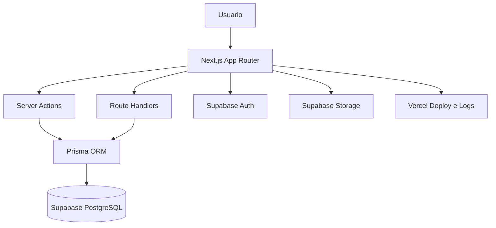

# ARQUITETURA.md - Arquitetura do Sistema

**Projeto:** Tyr_Controle  
**Atualizado em:** 2026-06-23  
**Status:** Planejamento / MVP a iniciar  

---

## 1. Visao Geral

O Tyr_Controle sera uma plataforma web para acompanhamento de projetos de software. O sistema deve centralizar desenvolvedores, projetos, escopos, roadmaps, marcos, tarefas, prazos, impedimentos, entregas, relatorios e historico de evolucao.

O publico-alvo inclui equipes de tecnologia, gestores, clientes e responsaveis tecnicos que precisam acompanhar o andamento real de projetos com transparencia e rastreabilidade.

## 2. Stack Tecnologica Definida

### Frontend

- Linguagem: TypeScript.
- Framework: Next.js App Router com React.
- UI library: Tailwind CSS, shadcn/ui e lucide-react.
- Formularios: React Hook Form com Zod.
- Tabelas: TanStack Table.
- Graficos: Recharts.
- Datas: date-fns.
- Testes: Vitest, React Testing Library e Playwright.

### Backend

- Linguagem: TypeScript.
- Framework: Next.js com Server Actions e Route Handlers.
- Validacao: Zod.
- Autenticacao: Supabase Auth.
- Autorizacao: RBAC por perfis.
- Testes: Vitest e Playwright.

### Banco de Dados

- Banco: PostgreSQL via Supabase.
- ORM: Prisma.
- Migrations: Prisma Migrate.
- Storage: Supabase Storage.
- Seeds: PENDENTE DE VALIDACAO.

### Infraestrutura

- Deploy: Vercel.
- Banco gerenciado: Supabase.
- Docker: NAO IDENTIFICADO NO REPOSITORIO.
- CI/CD: PENDENTE DE VALIDACAO.
- Observabilidade: Vercel logs/analytics inicialmente; monitoramento avancado pendente.

## 3. Estrutura de Pastas Atual

```text
/
|-- README.md
|-- PROMPT_GOVERNANCE_REPOSITORIO_COMPLETO.md
|-- Escopo do Projeto - Acompanhamento de Desenvolvimento.md
|-- Escopo do Projeto - Acompanhamento de Desenvolvimento.pdf
|-- AGENTS.md
|-- ARQUITETURA.md
|-- BANCO_DADOS.md
|-- ESCOPO.md
|-- ROADMAP.md
|-- CONTEXTO.md
`-- RELATORIO.md
```

Ainda nao existe aplicacao Next.js, diretorio `src/`, `app/`, `prisma/`, testes ou configuracao de build no repositorio.

## 4. Arquitetura Geral

Arquitetura alvo: monolito web full-stack com Next.js, usando Supabase para autenticacao, banco PostgreSQL e storage.



## 5. Modulos do Sistema

### Autenticacao e Usuarios

- Responsabilidade: login, sessao, usuarios e perfis.
- Principais arquivos/pastas: A CONFIRMAR apos bootstrap Next.js.
- Funcionalidades: autenticar, proteger rotas, controlar acesso por perfil.
- Dependencias: Supabase Auth, RBAC, Prisma.
- Status: planejado.

### Desenvolvedores

- Responsabilidade: cadastro, disponibilidade, stack, senioridade e alocacao.
- Funcionalidades: criar, editar, inativar, vincular a projetos e consultar historico.
- Status: planejado.

### Projetos

- Responsabilidade: cadastro e acompanhamento de projetos.
- Funcionalidades: criar, editar, acompanhar status, equipe, prazos, prioridade e historico.
- Status: planejado.

### Escopos

- Responsabilidade: documentar o que sera desenvolvido em cada projeto.
- Funcionalidades: versionar escopo, aprovar itens, separar por modulo e registrar mudancas.
- Status: planejado.

### Roadmaps e Marcos

- Responsabilidade: organizar fases, entregas, prioridades e eventos relevantes.
- Funcionalidades: criar fases, atribuir responsaveis, acompanhar datas e registrar marcos.
- Status: planejado.

### Tarefas, Backlog e Kanban

- Responsabilidade: gestao operacional das atividades.
- Funcionalidades: tarefas por projeto, responsavel, prioridade, status, comentarios, anexos e quadro Kanban.
- Status: planejado.

### Prazos e Impedimentos

- Responsabilidade: controlar datas, atrasos, gargalos e bloqueios.
- Funcionalidades: alertas, comparativos, registro de impedimentos e impacto no cronograma.
- Status: planejado.

### Dashboard e Relatorios

- Responsabilidade: indicadores executivos e tecnicos.
- Funcionalidades: KPIs, graficos, relatorios por projeto, cliente, desenvolvedor e entregas.
- Status: planejado.

### Documentacao, Aprovacoes e Auditoria

- Responsabilidade: rastreabilidade, documentos, aprovacoes e historico.
- Funcionalidades: anexos, versionamento, aprovacoes formais, mudancas de escopo e audit logs.
- Status: planejado.

## 6. Funcionalidades Confirmadas pelo Escopo

| Funcionalidade | Modulo | Status | Evidencia |
|---|---|---|---|
| Login e autenticacao | Auth | Planejado | `Escopo do Projeto - Acompanhamento de Desenvolvimento.md` |
| Cadastro de usuarios | Usuarios | Planejado | `Escopo do Projeto - Acompanhamento de Desenvolvimento.md` |
| Cadastro de desenvolvedores | Desenvolvedores | Planejado | `Escopo do Projeto - Acompanhamento de Desenvolvimento.md` |
| Cadastro de projetos | Projetos | Planejado | `Escopo do Projeto - Acompanhamento de Desenvolvimento.md` |
| Gestao de escopo | Escopos | Planejado | `Escopo do Projeto - Acompanhamento de Desenvolvimento.md` |
| Gestao de roadmap | Roadmaps | Planejado | `Escopo do Projeto - Acompanhamento de Desenvolvimento.md` |
| Marcos de desenvolvimento | Marcos | Planejado | `Escopo do Projeto - Acompanhamento de Desenvolvimento.md` |
| Tarefas e backlog | Tarefas | Planejado | `Escopo do Projeto - Acompanhamento de Desenvolvimento.md` |
| Dashboard basico | Dashboard | Planejado | `Escopo do Projeto - Acompanhamento de Desenvolvimento.md` |
| Relatorios simples | Relatorios | Planejado | `Escopo do Projeto - Acompanhamento de Desenvolvimento.md` |

## 7. Funcionalidades Pendentes ou Futuras

| Funcionalidade | Motivo da pendencia | Proxima acao |
|---|---|---|
| Kanban visual | Citado como avancado | Especificar apos MVP |
| Portal do cliente | Citado como evolucao | Definir permissoes e fluxo |
| Integracao com GitHub/GitLab | Futuro | Definir provedor e escopo |
| IA para resumos e riscos | Futuro | Definir casos de uso e custo |
| WhatsApp/Slack/Discord | Futuro | Definir canais prioritarios |
| Relatorios PDF/Excel | Futuro | Definir templates e formato |

## 8. Fluxos Principais

- Login: usuario informa credenciais, Supabase Auth valida sessao, Next.js protege rotas conforme perfil.
- Cadastro de projeto: gestor/admin cria projeto, vincula cliente, prazos, responsaveis e equipe.
- Gestao de tarefas: usuario cria tarefa, define responsavel/status/prazo e acompanha no backlog ou Kanban.
- Atualizacao de projeto: responsavel registra andamento, riscos, bloqueios e proximos passos.
- Relatorio: sistema consolida progresso, atrasos, entregas e impedimentos.

## 9. Integracoes Externas

| Integracao | Finalidade | Onde sera usada | Status | Observacoes |
|---|---|---|---|---|
| Supabase Auth | Autenticacao | Login e sessao | Definido | Requer configuracao |
| Supabase PostgreSQL | Persistencia | Toda aplicacao | Definido | Requer schema Prisma |
| Supabase Storage | Anexos | Tarefas/documentos | Definido | Requer politicas |
| Vercel | Deploy | Aplicacao Next.js | Definido | Requer projeto |
| GitHub/GitLab | Atividade de repositorio | Futuro | Planejado | Nao faz parte do MVP inicial |

## 10. Seguranca e Autenticacao

- Autenticacao via Supabase Auth.
- Autorizacao via RBAC com perfis: Administrador, Gestor de Projeto, Desenvolvedor e Cliente/Visualizador.
- Protecao de rotas no Next.js por middleware, Server Components e verificacao server-side.
- Validacao de entradas com Zod.
- RLS habilitado por padrao em tabelas expostas no Supabase.
- Segredos somente em variaveis server-side; `service_role` nunca deve ir para o client.

## 11. Build, Execucao e Testes

Comandos esperados apos bootstrap:

```bash
npm install
npm run dev
npm run lint
npm run test
npm run test:e2e
npm run build
npx prisma migrate dev
npx prisma studio
```

No estado atual, esses comandos ainda nao existem porque a aplicacao Next.js nao foi criada.

## 12. Pontos de Atencao Tecnica

- Repositorio ainda nao possui codigo de aplicacao.
- Schema do banco ainda nao foi implementado.
- Supabase, Vercel e Prisma ainda nao estao configurados.
- Testes ainda nao estao configurados.
- Politicas RLS precisam ser definidas antes de expor dados.
- Autorizacao nao deve depender de metadata editavel pelo usuario.

## 13. Decisoes Arquiteturais

| Data | Decisao | Motivo | Impacto |
|---|---|---|---|
| 2026-06-23 | Usar Next.js full-stack com TypeScript | Acelerar MVP e reduzir complexidade operacional | Frontend e backend no mesmo projeto |
| 2026-06-23 | Usar Supabase + PostgreSQL | Acelerar auth, banco e storage | Requer politicas RLS e cuidado com secrets |
| 2026-06-23 | Usar Prisma | Versionar schema e melhorar DX | Migrations via Prisma Migrate |
| 2026-06-23 | Usar Vercel | Deploy natural para Next.js | Infra inicial simplificada |
