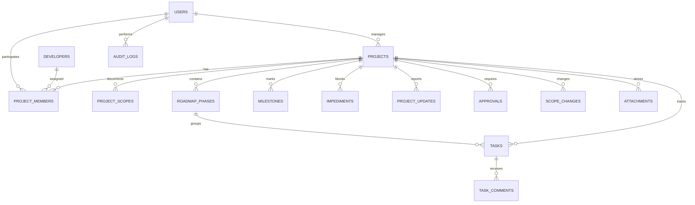

# BANCO_DADOS.md - Arquitetura de Banco de Dados

**Projeto:** Tyr_Controle  
**Atualizado em:** 2026-06-23  
**Banco identificado:** PostgreSQL via Supabase  

---

## 1. Visao Geral

O banco de dados oficial do projeto sera PostgreSQL gerenciado pelo Supabase. A camada de modelagem e migrations sera feita com Prisma.

No estado atual do repositorio ainda nao existem schema Prisma, migrations, seeds ou codigo de acesso a dados. A estrutura abaixo representa a modelagem alvo inicial derivada do escopo do projeto.

## 2. Tecnologia e Ferramentas

- Banco: PostgreSQL via Supabase.
- ORM: Prisma.
- Migration tool: Prisma Migrate.
- Seeds: PENDENTE DE VALIDACAO.
- Ambiente local: PENDENTE DE VALIDACAO.
- Ambiente producao: Supabase.
- String de conexao: `NAO DOCUMENTAR VALORES SENSIVEIS`.

## 3. Localizacao dos Arquivos de Banco

| Tipo | Caminho | Observacao |
|---|---|---|
| Schema Prisma | `prisma/schema.prisma` | A criar |
| Migrations Prisma | `prisma/migrations/` | A criar |
| Seed | `prisma/seed.ts` | PENDENTE DE VALIDACAO |
| Cliente Prisma | `src/lib/prisma.ts` | A criar |
| Clientes Supabase | `src/lib/supabase/` | A criar |
| Politicas RLS | Supabase SQL/migrations | A definir |

## 4. Modelo Entidade-Relacionamento Alvo



## 5. Tabelas Alvo

| Tabela | Finalidade | Status |
|---|---|---|
| `users` | Perfil interno vinculado ao Supabase Auth | Planejada |
| `developers` | Dados profissionais dos desenvolvedores | Planejada |
| `projects` | Projetos acompanhados pela plataforma | Planejada |
| `project_members` | Vinculo entre projetos, usuarios e desenvolvedores | Planejada |
| `project_scopes` | Escopos e versoes de escopo por projeto | Planejada |
| `roadmap_phases` | Fases do roadmap | Planejada |
| `milestones` | Marcos de desenvolvimento | Planejada |
| `tasks` | Tarefas do projeto | Planejada |
| `task_comments` | Comentarios em tarefas | Planejada |
| `impediments` | Bloqueios e impedimentos | Planejada |
| `project_updates` | Atualizacoes periodicas do projeto | Planejada |
| `approvals` | Aprovacoes formais | Planejada |
| `scope_changes` | Mudancas de escopo | Planejada |
| `notifications` | Notificacoes internas | Planejada |
| `attachments` | Metadados de arquivos no Supabase Storage | Planejada |
| `audit_logs` | Historico/auditoria | Planejada |

## 6. Campos Base Recomendados

Todas as tabelas de dominio devem considerar:

- `id`
- `created_at`
- `updated_at`
- `deleted_at`, quando houver soft delete
- `created_by`, quando aplicavel
- `updated_by`, quando aplicavel

Campos especificos devem ser definidos em SDD antes de criar migrations.

## 7. Regras de Integridade

- Um projeto pode ter varios desenvolvedores.
- Um desenvolvedor pode participar de varios projetos.
- Um projeto pode ter varias fases no roadmap.
- Uma fase pode ter varias tarefas.
- Uma tarefa deve possuir responsavel.
- Um marco pode estar vinculado a uma fase ou ao projeto.
- Alteracoes de escopo devem gerar historico.
- Projetos concluidos nao devem permitir alteracoes sem permissao administrativa.
- Clientes devem visualizar apenas projetos autorizados.
- Toda alteracao relevante deve gerar auditoria.

## 8. Migrações

Ainda nao existem migrations no repositorio.

Politica obrigatoria:

- Nunca editar migration ja aplicada em producao.
- Criar nova migration corretiva quando houver ajuste.
- Revisar impacto de dados antes de alterar tabela usada por funcionalidades existentes.
- Validar RLS quando tabelas forem expostas via Supabase.

Comandos esperados:

```bash
npx prisma migrate dev
npx prisma studio
```

## 9. Seeds e Dados Iniciais

PENDENTE DE VALIDACAO.

Seeds possiveis:

- Perfis padrao de acesso.
- Usuario administrador inicial, sem senha real documentada.
- Status padrao de projetos, tarefas, marcos e aprovacoes.
- Prioridades padrao.

## 10. Acesso a Dados

Padrao recomendado:

- Usar Prisma para queries server-side.
- Usar Supabase Auth para sessao.
- Usar Supabase Storage para arquivos.
- Nunca usar chaves privilegiadas no client.
- Concentrar regras de escrita em Server Actions ou Route Handlers.
- Validar payloads com Zod antes de persistir.

## 11. Indices e Performance

Indices iniciais sugeridos:

| Tabela | Campos | Motivo |
|---|---|---|
| `projects` | `status`, `responsible_user_id` | Listagens e dashboard |
| `tasks` | `project_id`, `status`, `assignee_id`, `due_date` | Kanban, prazos e filtros |
| `milestones` | `project_id`, `status`, `due_date` | Acompanhamento de marcos |
| `project_updates` | `project_id`, `created_at` | Timeline do projeto |
| `audit_logs` | `entity_type`, `entity_id`, `created_at` | Auditoria e rastreabilidade |

## 12. Seguranca dos Dados

- Habilitar RLS em tabelas expostas no Supabase.
- Nao usar `user_metadata` como fonte de autorizacao.
- Armazenar permissoes em tabela propria ou claims controladas pelo backend.
- Proteger dados de clientes e projetos por perfil.
- Registrar auditoria para alteracoes relevantes.
- Nao documentar strings de conexao, tokens ou senhas.

## 13. Pendencias e Riscos

| Item | Risco | Severidade | Acao recomendada |
|---|---|---|---|
| Schema Prisma inexistente | Implementacao sem contrato de dados | Alta | Criar SDD do modelo inicial |
| RLS nao configurado | Exposicao indevida de dados | Alta | Criar politicas antes de producao |
| Seeds indefinidos | Ambiente inicial inconsistente | Media | Definir dados minimos |
| Autorizacao pendente | Cliente pode acessar dados indevidos | Alta | Modelar RBAC antes dos CRUDs |
